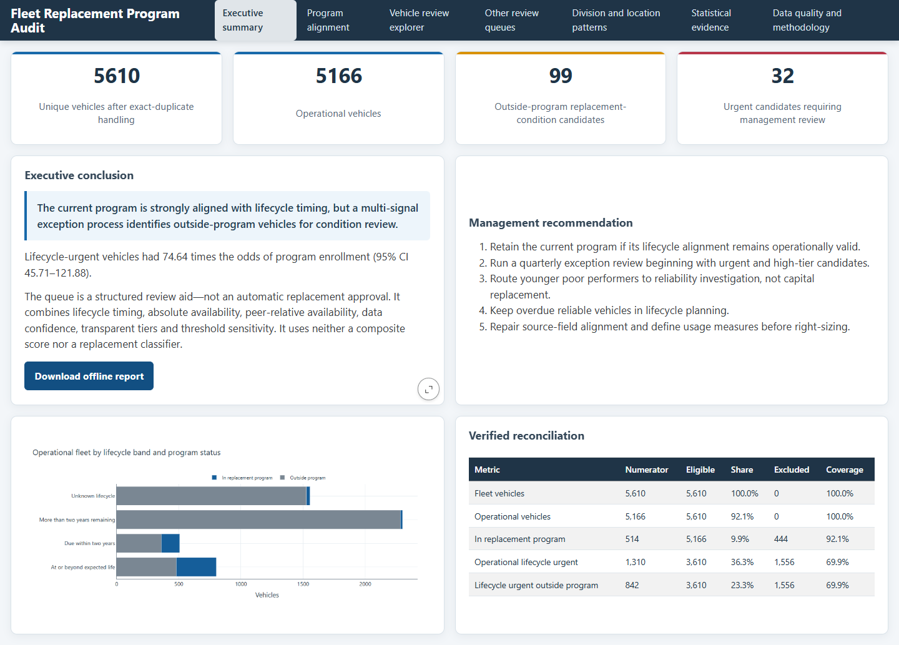
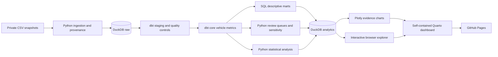

# Fleet Replacement Program Audit

A decision-support case study that audits an existing fleet replacement program and identifies the vehicles that deserve management review next.

[](https://github.com/lirunxi/fleet-replacement-program-audit/actions/workflows/ci.yml)

**[View the live dashboard](https://lirunxi.github.io/fleet-replacement-program-audit/)** · **[Read the methodology](METHODOLOGY.md)**



## At a glance

| Scope | Verified result |
|---|---:|
| Vehicles in the analytical fleet | 5,610 |
| Operational vehicles assessed | 5,166 |
| Outside-program condition-review candidates | 99 |
| Urgent candidates | 32 |
| Additional reliability investigations | 319 |
| Threshold scenarios tested | 6 |

## The business question

Fleet replacement budgets are limited, but age alone is a weak basis for allocating them. The existing program flag records a management decision; it does not show whether every enrolled vehicle has observable support or whether important exceptions remain outside the program.

This analysis asks:

> Is the current replacement program aligned with lifecycle and reliability evidence, and which operational vehicles outside the program should management review first?

The result is a review queue, not an automated replacement verdict. Every vehicle retains the evidence, data-confidence level, peer comparison and reason codes behind its proposed action.

## What the analysis found

The current program is strongly aligned with lifecycle timing. Vehicles at or beyond expected life had **74.6 times the odds of program enrollment** compared with vehicles that had more than two years remaining (95% CI: 45.7–121.9).

The analysis also found **99 operational vehicles outside the program** that combine lifecycle urgency, low availability and weak performance relative to comparable vehicles. Of these, 32 are classified as Urgent, 12 as High and 55 as Planning cases.

The more important finding is that age should not be treated as a replacement decision by itself. Across all eligible operational vehicles, those at or beyond expected life had a median availability proxy only **1.8 percentage points lower** than other vehicles (95% BCa CI: -3.4 to -0.5 points). Once vehicles already in the program were excluded, the gap was **0.2 points** and was not statistically distinguishable from zero (95% BCa CI: -1.8 to 0.9; p = 0.764).

### Recommendation

Keep the current lifecycle-based program, but add a quarterly exception review for the 99 multi-signal candidates. Inspect vehicle condition before changing the capital plan. Route 319 younger or incomplete-signal poor performers to reliability investigation, and keep 516 overdue but acceptably available vehicles in lifecycle planning instead of treating them as automatic replacement cases.

This approach focuses inspection time on defensible exceptions while avoiding unnecessary replacement of older vehicles that continue to perform reliably.

## What I built

- A text-first ingestion pipeline that preserves source values, file hashes and row-level provenance.
- A DuckDB warehouse with `raw`, `staging`, `core` and `analytics` schemas.
- Modular dbt models and tests for cleaning, validation, joins and analytical marts.
- A multi-signal vehicle review framework using lifecycle, availability, peer performance and data confidence.
- Statistical tests with effect sizes, confidence intervals and explicit population definitions.
- Sensitivity analysis across six threshold scenarios and Pareto ordering without a weighted score.
- A self-contained interactive HTML dashboard with filters, sortable tables and CSV export.
- Synthetic-data CI so the public repository can be tested without publishing the source files.

## Decision framework

An operational vehicle outside the current program enters the replacement-condition queue only when all five conditions are met:

1. Lifecycle data and availability are reliable enough to assess.
2. The vehicle is at or beyond expected life, or due within two years.
3. Its availability proxy is below 80%.
4. Its availability is in the bottom 20% of an eligible peer group.
5. It is not already in the replacement program.

Peer groups use `unit type + expected-life year`, with a unit-type fallback when the primary group is too small. High-priority status can raise review urgency, but it cannot create a replacement recommendation on its own.

Vehicles that do not meet the complete rule are routed to a more appropriate queue:

| Queue | Management use |
|---|---|
| Replacement condition assessment | Inspect multi-signal candidates before changing the capital plan |
| Reliability investigation | Diagnose poor availability without sufficient replacement evidence |
| Lifecycle planning | Monitor vehicles approaching or exceeding expected life that remain acceptably available |
| Data quality review | Resolve records that cannot support a reliable decision |

No composite score is used. Candidates are ordered by Pareto front across three observable dimensions: life consumed, availability and peer percentile. Selection is then recomputed under six threshold combinations to show whether each result is stable or threshold-sensitive.

## Architecture



The complete build runs through one command:

```powershell
python run_pipeline.py all
```

Temporary build artifacts protect the last verified database and report if a stage fails.

## Analytical approach

The project separates two different jobs:

- **Vehicle-level triage** uses transparent business rules and observed evidence.
- **Population-level inference** tests whether broader patterns are large and consistent enough to inform policy.

The statistical work includes permutation testing, bias-corrected bootstrap confidence intervals, Cliff's delta, chi-square and Fisher exact tests, odds ratios, false-discovery-rate correction and explanatory logistic regression. Effect sizes and confidence intervals are interpreted before p-values; the tests never decide whether an individual vehicle should be replaced.

See [METHODOLOGY.md](METHODOLOGY.md) for metric definitions, eligibility rules, hypothesis specifications, regression safeguards and sensitivity design.

## Data quality as an analytical result

The source contains numeric fields with text values and semantic values in unrelated columns. The pipeline preserves the original text, creates separate typed fields and records why a value was excluded. It never moves suspected displaced values between columns automatically.

The most consequential limitation is usage-data displacement, affecting 2,140 records. Usage and VEU therefore remain on the data-quality page and do not influence vehicle recommendations. Raw files are excluded from Git because redistribution rights are unknown.

## Technology stack

| Layer | Tools |
|---|---|
| Ingestion and orchestration | Python 3.12, pandas, NumPy |
| Storage and SQL modeling | DuckDB 1.5.5, dbt-duckdb 1.11.0 |
| Statistical analysis | SciPy, statsmodels |
| Reporting | Plotly, Quarto, browser-side JavaScript |
| Quality assurance | pytest, Ruff, dbt tests, Playwright |
| Delivery | GitHub Actions, GitHub Pages |

Dependencies are pinned in [requirements.lock](requirements.lock). The bootstrap script installs the required Quarto version locally so the build does not depend on a machine-wide installation.

## Repository structure

```text
.
├── data/                  # Private inputs and generated warehouse (ignored)
├── dbt/                   # SQL models, seeds and data tests
├── docs/                  # Published dashboard and preview
├── reports/               # Quarto template, styling and browser assets
├── scripts/               # Environment bootstrap and utilities
├── src/fleet_analysis/    # Pipeline, statistics and prioritization code
├── tests/                 # Unit, integration and browser acceptance tests
├── METHODOLOGY.md         # Detailed analytical design
├── pyproject.toml
└── run_pipeline.py
```

## Run locally

Prerequisites: Windows, PowerShell and Python 3.12. Place the two private source files at:

```text
data/raw/RAW_Fleet_Units.csv
data/raw/RAW_Fleet_Usage.csv
```

Then run:

```powershell
powershell -ExecutionPolicy Bypass -File scripts/bootstrap.ps1
.venv\Scripts\python.exe run_pipeline.py all
.venv\Scripts\python.exe run_pipeline.py test
```

The verified warehouse is written to `data/fleet_analytics.duckdb`; the standalone report is written to `docs/index.html`.

## Verification

The release checks cover:

- 13 Python tests for ingestion, boundary conditions, action precedence, Pareto logic and statistical reproducibility;
- 25 dbt tests for key integrity, row preservation, joins, normalization and metric validity;
- report reconciliation against DuckDB result tables; and
- browser acceptance tests for offline loading, filters, reset, search, CSV/report downloads and console errors.

GitHub Actions repeats the test suite with generated synthetic fixtures, so continuous integration does not require access to the private data.

## Limitations and next steps

- This is a cross-sectional snapshot; observed relationships are not causal.
- Availability is a calculated proxy because the source lacks an authoritative definition.
- Work-order cost, breakdown, safety and replacement-outcome history are unavailable.
- Division differences may reflect unmeasured duty cycles or operating environments.
- A shortlist row means “inspect and review,” not “replace.”
- Original vehicle IDs are included in the dashboard under the current publication decision and should remain subject to the data owner's disclosure policy.

The next analytical step would be a garage-level randomized pilot comparing the structured review process with the existing process. The primary outcome would be the share of inspections that lead to a confirmed actionable intervention within 90 days.
